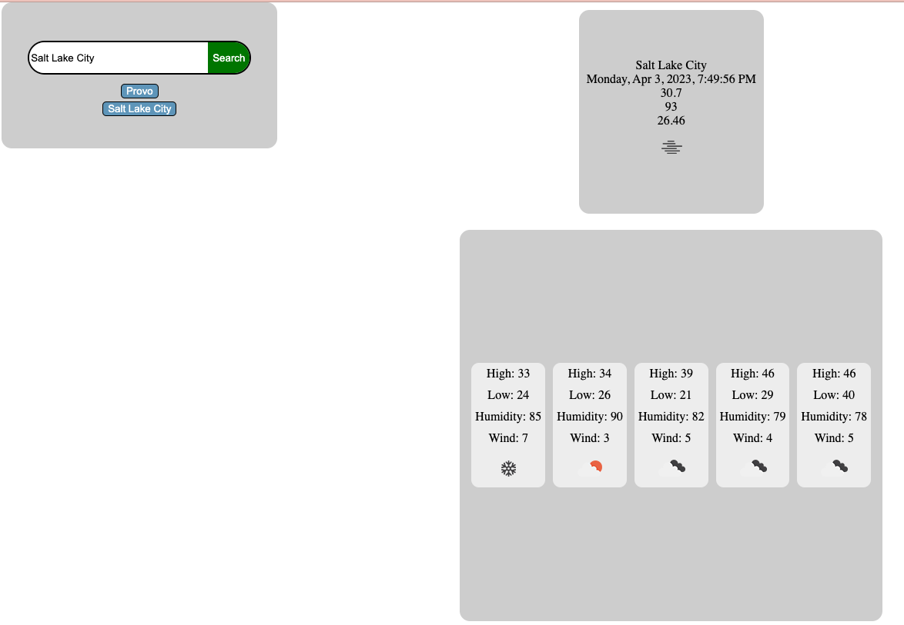

# Weather Dashboard Module 6 Challenge
## Description

This project is Module 6 challenge of U of U's professional bootcamp. This project uses openweathermap.org API to display current and forecasted weather for a city given by user input.

## Installation

N/A

## Usage

GitHub repository: https://github.com/Jonochi/weather-dashboard

GitHub Deployed Project Page: https://jonochi.github.io/weather-dashboard/

Project screenshot:
    

## Credits

N/A

## License

N/A
